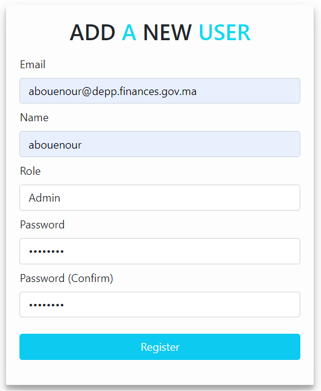

# TechTerminologyAssist

In the world of public finance control and auditing, controllers often face challenges in understanding the technical terms within financial reports from various institutions. This difficulty arises from the fact that they may not have prior knowledge in specific technical domains. To address this issue, we have developed a dynamic web application called "TechTerminologyAssist." This application, upon uploading a file, extracts all technical terms from the document and displays detailed definitions sourced from a specialized dictionary.

## Features

- **File Upload**: You can upload PDF or Word files containing financial reports.
- **Extraction of Technical Terms**: Our machine learning model identifies relevant technical terms within the document.
- **Display Definitions**: Technical terms are associated with comprehensive definitions, making it easier to comprehend the report's content.

## How It Works

1. **Upload Your File**: Click the upload button and select the financial report file you want to analyze.

2. **Wait a Few Moments**: Our model will analyze the file and identify technical terms.

3. **Review Definitions**: Once the analysis is complete, you can review the technical terms and their associated definitions.

## Usage

- You can use this application to assist state controllers, auditors, and financial professionals in better understanding technical financial reports, even if they have no prior expertise in a specific domain.
- Definitions are extracted from a database of technical terms, ensuring a reliable source of information.

## Interface Screenshots

Here are some screenshots of the "TechTerminologyAssist" interface to give you a visual preview of the application:
###  Registration Interface
Only administrators can access this page and add user or administrator accounts.

### Authentication Interface
To access the main page, the user must authenticate using their email and password.

### Main Page
The main page allows the user to upload a file (.pdf, .doc, .docx). The navbar consists of a "Logout" button that allows the user to log out, an "Add new user" button that gives the admin the ability to add a new user, and a "Home" button to stay on the same page.

### Result Page
This page displays the definition for each technical term and provides the option to click on the "See Details" link, which redirects the user to the Wikipedia source page if they need more explanation.

## Video Demo

We have created a video demonstration to showcase how to use "TechTerminologyAssist." Watch the video for a quick overview of its features and usage.

## License

This project is licensed under the [MIT License](LICENSE).

Feel free to explore our application and provide us with your feedback and suggestions. We hope that "TechTerminologyAssist" simplifies the understanding of technical financial reports for public finance professionals.

